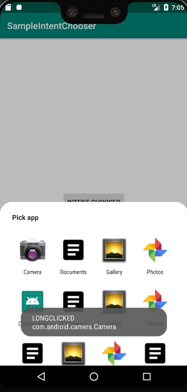

# JJIntentChooser

Simple intent chooser 


## Usage

1.-Add it in your root build.gradle at the end of repositories:
```
allprojects {
		repositories {
			...
			maven { url 'https://jitpack.io' }
		}
	}
```
2.- Add the dependency
```
dependencies {
	        implementation 'com.github.Only-IceSoul:JJIntentChooser:1.0'
	}
```


## Preview




# Using IntentChooser
```
            JJIntentChooser(this)
                .setTitle("Pick app")
                .setIntent(PrimaryIntent())
                .setIntentSecondaries(
                   // intents for query or normal intents
                )
                .startForResult(100)
```


## Ignore 


 ActivityInfo Name

 ```
   .setIgnore("com.google.android.apps.photos.picker.external.ExternalPickerActivity",etc...)

```


# Tracking when an activity was clicked 

```
class TrackingIntentChooserActivity : JJIntentChooserActivity() {


    override fun onIntentClicked(resolveInfo: ResolveInfo) {
        Toast.makeText(this, "info: ${resolveInfo.activityInfo.packageName} ${resolveInfo.activityInfo.name}",Toast.LENGTH_SHORT).show()

         //do something or request permission 
       super.onIntentClicked(resolveInfo) //super call startActivity

    }

        override fun onIntentLongClicked(resolveInfo: ResolveInfo): Boolean {
        Toast.makeText(this, "LongClicked info: $ {resolveInfo.activityInfo.packageName}  ${resolveInfo.activityInfo.name}",Toast.LENGTH_SHORT).show()

                 //do something
        return super.onIntentLongClicked(resolveInfo) 
    }
}

```


**Declare in the AndroidManifest.xml**

    <activity
        android:name=".TrackingActivity"
        android:theme="@style/ChooserActivity" />


**Declare in Code**


    .setActivity(TrackingActivity::class.java)
    .startForResult(requestCode = 100)


# License

[see License ](https://github.com/Only-IceSoul/JJIntentChooser/blob/master/LICENSE)